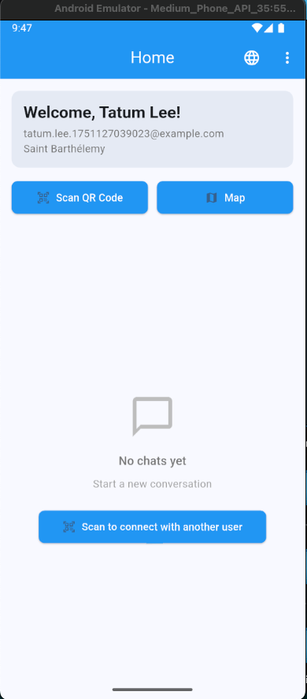
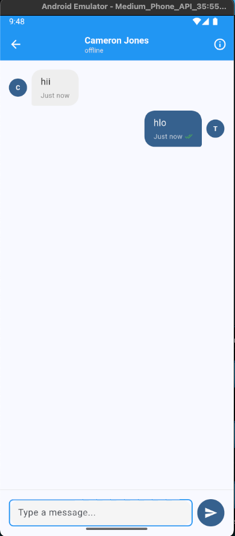
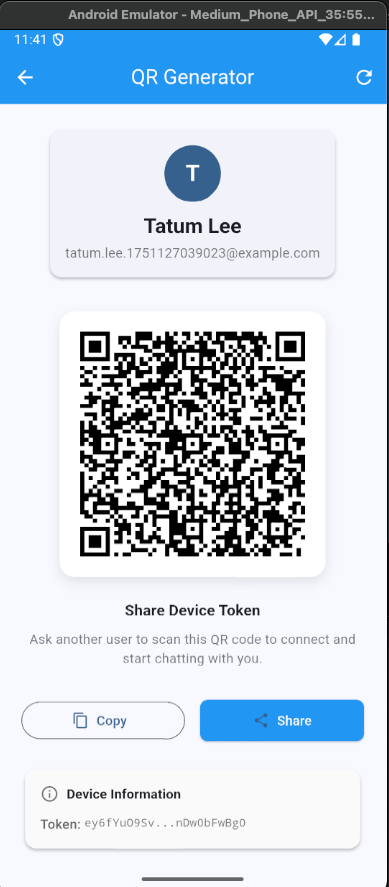
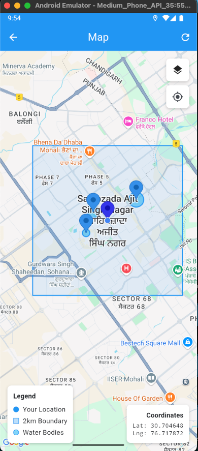
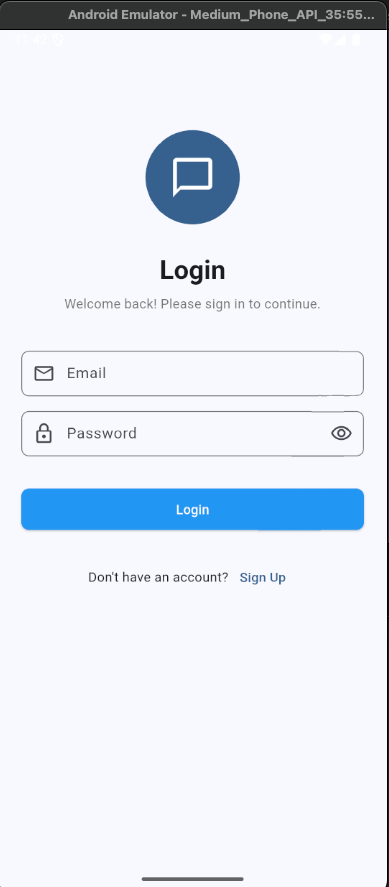
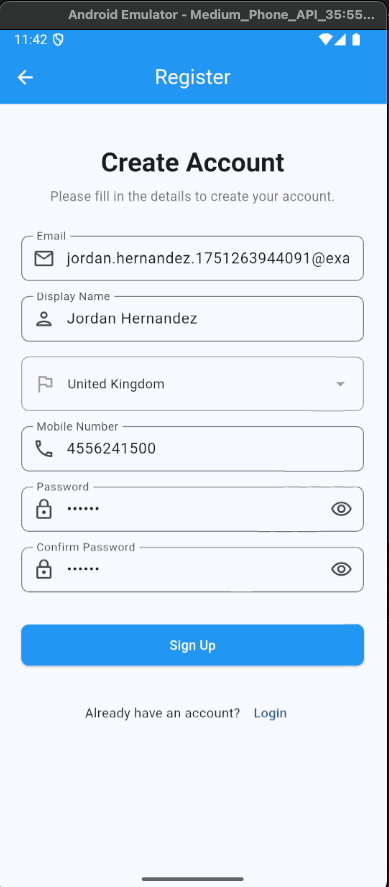

# 💬 Chat App - Flutter Multi-Platform Messaging Application

A production-ready Flutter chat application with real-time messaging, QR code user connection, maps integration, and multi-language support.

> **🤖 AI-Powered Development**: This project was developed with assistance from **Claude (Anthropic's AI Assistant)** for architecture design, implementation, debugging, and comprehensive documentation.

## 🎯 Quick Preview

<div align="center">
   

**[📥 Download APK](apk/app-release.apk)** | **[📸 View All Screenshots](#-screenshots)** | **[📚 Documentation](#-documentation)**
</div>

## 📑 Table of Contents

- [🎯 Quick Preview](#-quick-preview)
- [🚀 Features](#-features)
- [🏗️ Architecture](#️-architecture)
- [📱 Download & Try](#-download--try)
- [📸 Screenshots](#-screenshots)
- [📋 Requirements](#-requirements)
- [🛠️ Installation](#️-installation)
- [⚙️ Configuration](#️-configuration)
- [🚀 Running the App](#-running-the-app)
- [📄 Documentation](#-documentation)
- [🤖 AI Development Credits](#-ai-development-credits)

---

## 🚀 Features

### ✅ Core Functionality
- **Real-time Messaging**: Instant text-based chat with Firebase Cloud Messaging (FCM v1 API)
- **User Authentication**: Secure email/password login and registration with persistent sessions
- **QR Code Connection**: Share device tokens via QR codes for seamless user pairing
- **Maps Integration**: Google Maps with current location, geofencing, and location tracking
- **Multi-language Support**: English and Arabic with full RTL layout support
- **Cross-platform**: Native Android, iOS, and Web support

### ✅ Advanced Features
- **Bidirectional Messaging**: Automatic FCM token exchange for two-way communication
- **Real-time Chat Updates**: Messages appear instantly without page refresh
- **Persistent Storage**: SQLite database for offline message storage
- **Local Persistent Storage**: SQLite-based user data storage (survives app updates)
- **Auto-Login**: Automatic user login for returning users
- **Device-Specific Security**: User data tied to specific devices for security
- **Cross-Platform Notifications**: Firebase (Android/Web) + APNs (iOS) integration
- **Enhanced Camera Integration**: Robust QR scanner with permission handling and error recovery
- **Location Services**: GPS tracking with comprehensive permission management
- **Push Notifications**: Background and foreground notification support with local notifications
- **Auto-filled Registration**: Development-friendly form pre-filling

### 🆕 **Latest Enhancements (2024)**
- **FCM v1 API**: Updated to latest Firebase Cloud Messaging API
- **APNs Integration**: Native iOS push notifications to resolve Firebase build issues
- **Unified Messaging Service**: Platform-aware notification system
- **Enhanced QR Parsing**: Improved parsing for complex FCM tokens with colons
- **Camera Permission Recovery**: Advanced permission handling with retry mechanisms
- **Comprehensive Error Handling**: Graceful failure recovery across all features
- **⚠️ Android Storage Reality**: Documented normal app uninstall behavior and cloud alternatives

### 🔧 Technical Features
- **State Management**: GetX for reactive state management
- **Local Database**: SQLite for offline message storage
- **Push Notifications**: Firebase Cloud Messaging for real-time notifications
- **Location Services**: Real-time location tracking and map visualization
- **Responsive Design**: Material Design 3 with adaptive layouts
- **Country Selection**: REST Countries API integration for registration

## 🏗️ Architecture

- **Pattern**: MVVM with GetX
- **State Management**: GetX (Reactive)
- **Database**: SQLite with sqflite
- **Backend**: Firebase (Authentication, Cloud Messaging)
- **Navigation**: GetX Navigation
- **Internationalization**: GetX Translations

## 📱 Download & Try

### **🔽 Ready-to-Install APK**
Download the latest release APK and try the app immediately:

<div align="center">

**[📥 Download APK (33.4MB)](apk/app-release.apk)**

| **APK Details** | **Information** |
|-----------------|-----------------|
| **📱 Platform** | Android 5.0+ (API 21+) |
| **📦 Size** | 33.4 MB |
| **🔧 Build Type** | Release (Optimized) |
| **🛡️ Security** | Signed APK |
| **📅 Build Date** | June 28, 2025 |

</div>

### **📲 Installation Instructions**
1. **Download** the APK file from the link above
2. **Enable** "Install from unknown sources" in your Android settings:
   - Go to Settings → Security → Unknown Sources (Android 7 and below)
   - Go to Settings → Apps → Special Access → Install Unknown Apps (Android 8+)
3. **Open** the downloaded APK file
4. **Follow** the installation prompts
5. **Launch** the app and start chatting!

---

## 📸 Screenshots

<div align="center">

### **🏠 Authentication & Home**
| Login Screen | Registration | Home Dashboard |
|:---:|:---:|:---:|
|  |  |  |
| Secure email/password login | User registration with validation | Clean dashboard interface |

### **💬 Messaging & QR Connection**
| QR Code Scanner | Chat Interface |
|:---:|:---:|:---:|
|  |  | 
| Camera-based QR scanning | Real-time messaging |

### **🗺️ Maps & Location**
| Maps Integration |
|:---:|
|  |
| Google Maps with location tracking |

### **✨ Key Features Demonstrated**

- **🔐 Secure Authentication**: Email/password login with form validation
- **📱 Modern UI**: Clean Material Design 3 interface with intuitive navigation
- **📷 QR Code Integration**: Camera-based scanning for instant user connection
- **💬 Real-time Chat**: Instant messaging with message persistence
- **🗺️ Location Services**: Interactive maps with GPS tracking
- **🌍 Multi-language**: Support for multiple languages and RTL layouts
- **📱 Cross-platform**: Consistent experience across Android, iOS, and Web

</div>

---

## 📋 Requirements

### Development Environment
- Flutter SDK 3.22.2+
- Dart SDK 3.4.3+
- Android Studio / VS Code
- Git

### Platform Requirements
- **Android**: API level 21+ (Android 5.0+)
- **iOS**: iOS 12.0+
- **Web**: Modern browsers (Chrome, Firefox, Safari, Edge)

## 🛠️ Installation

### 1. Clone the Repository
```bash
git clone <repository-url>
cd project
```

### 2. Install Dependencies
```bash
flutter pub get
```

### 3. Configure Firebase
1. Create a Firebase project at [Firebase Console](https://console.firebase.google.com)
2. Add your platform apps (Android/iOS/Web)
3. Download configuration files:
   - `google-services.json` for Android → `android/app/`
   - `GoogleService-Info.plist` for iOS → `ios/Runner/`
   - Web config → Update `web/index.html`

### 4. Configure Google Maps

#### Get API Key
1. Go to [Google Cloud Console](https://console.cloud.google.com)
2. Create a new project or select existing one
3. Enable the following APIs:
   - Maps SDK for Android
   - Maps SDK for iOS
   - Maps JavaScript API (for Web)
4. Create credentials → API Key
5. Restrict the API key (recommended for production)

#### Update Configuration Files
Replace `YOUR_GOOGLE_MAPS_API_KEY` in:

**Android** (`android/app/src/main/AndroidManifest.xml`):
```xml
<meta-data
    android:name="com.google.android.geo.API_KEY"
    android:value="YOUR_GOOGLE_MAPS_API_KEY" />
```

**iOS** (`ios/Runner/AppDelegate.swift`):
```swift
GMSServices.provideAPIKey("YOUR_GOOGLE_MAPS_API_KEY")
```

### 5. Configure FCM (Optional but Recommended)

For production FCM messaging, update the service account in `lib/app/services/firebase_service.dart`:
```dart
static const Map<String, dynamic> _serviceAccountJson = {
  // Your Firebase service account JSON here
};
```

### 6. Run the Application
```bash
# Check dependencies
flutter doctor

# Get dependencies
flutter pub get

# Run on specific platform
flutter run -d android    # Android
flutter run -d ios        # iOS
flutter run -d chrome     # Web

# Build for production
flutter build apk --release                    # Android APK
flutter build ios --release                    # iOS
flutter build web --release                    # Web
```

## 📱 Platform-Specific Setup

### iOS Additional Setup
1. **Xcode Configuration**:
   ```bash
   cd ios
   pod install
   ```

2. **Enable Capabilities in Xcode**:
   - Open `ios/Runner.xcworkspace` in Xcode
   - Select Runner target → Signing & Capabilities
   - Add "Push Notifications" capability
   - Add "Background Modes" → Remote notifications

3. **Update Bundle Identifier**:
   - Change `com.app.task` to your unique identifier
   - Update in both Xcode and Firebase console

### Android Additional Setup
1. **Signing Configuration** (for release builds):
   - Create `android/key.properties`
   - Update `android/app/build.gradle` with signing config

2. **Permissions**:
   - All required permissions are already configured
   - Users will be prompted at runtime

## 🏗️ Building for Production

### Android
```bash
# APK
flutter build apk --release

# App Bundle (recommended for Play Store)
flutter build appbundle --release
```

### iOS
```bash
flutter build ios --release
# Then archive in Xcode
```

### Web
```bash
flutter build web --release
```

## 📚 Key Dependencies

- **get**: State management and navigation
- **firebase_core & firebase_messaging**: Firebase integration
- **sqflite**: Local SQLite database
- **google_maps_flutter**: Maps integration
- **geolocator**: Location services
- **qr_flutter & mobile_scanner**: QR code functionality
- **shared_preferences**: Local storage
- **http & dio**: Network requests
- **permission_handler**: Runtime permissions

## 🌍 Supported Languages

- 🇺🇸 English
- 🇸🇦 Arabic (with RTL support)

## 📖 Usage

### Getting Started
1. **Register**: Create an account with email, country, and display name
2. **Generate QR**: Create your QR code for device token sharing
3. **Connect**: Scan another user's QR code to connect
4. **Chat**: Start messaging with connected users
5. **Maps**: View your location and nearby water bodies
6. **Settings**: Change language, view profile, logout

### Key Features Usage
- **QR Connection**: Go to Profile → Generate QR or use the QR scanner
- **Maps**: Access from home screen to see location and boundaries
- **Language**: Change in Profile → Language Settings
- **Notifications**: Automatic push notifications for new messages

## 🔧 Troubleshooting

### Common Issues

#### Maps Not Loading
- **Problem**: Map shows blank or "For development purposes only"
- **Solution**:
  1. Verify Google Maps API key is correct
  2. Enable required APIs in Google Cloud Console
  3. Check API key restrictions
  4. Ensure billing is enabled for Google Cloud project

#### FCM Notifications Not Working
- **Problem**: Messages sent but notifications not received
- **Solution**:
  1. Check Firebase configuration files are in correct locations
  2. Verify FCM service account is configured
  3. Ensure app has notification permissions
  4. Check device token is valid (140+ characters)

#### iOS Firebase Messaging Build Error (Known Issue)
- **Problem**: `Include of non-modular header inside framework module 'firebase_messaging.FLTFirebaseMessagingPlugin'`
- **Status**:
  - ✅ **Android**: Firebase Messaging works perfectly
  - ⚠️ **iOS**: Build fails due to Firebase header issue
  - ✅ **Web**: Firebase Messaging works when configured
- **Workaround**: See [FIREBASE_IOS_ISSUE.md](FIREBASE_IOS_ISSUE.md) for detailed solutions
- **Solution**: APNs implementation available - see [APNS_BACKEND_GUIDE.md](APNS_BACKEND_GUIDE.md)
- **Status**: APNs service integrated in Flutter app, backend setup required

#### QR Code Scanning Issues
- **Problem**: QR codes not scanning or parsing incorrectly
- **Solution**:
  1. Ensure camera permission is granted
  2. Check QR code format matches expected pattern
  3. Verify FCM tokens don't contain invalid characters
  4. Try regenerating QR code

### Debug Commands
```bash
# Check Flutter installation
flutter doctor -v

# Analyze code for issues
flutter analyze

# Clean and rebuild
flutter clean && flutter pub get && flutter run
```

## 📄 Documentation

### **📋 Project Overview**
- [PROJECT_SUMMARY.md](PROJECT_SUMMARY.md) - Comprehensive project overview and achievements

### **🚀 Deployment & Setup**
- [DEPLOYMENT.md](DEPLOYMENT.md) - Detailed deployment guide
- [BUILD_VERIFICATION.md](BUILD_VERIFICATION.md) - Implementation verification

### **🔧 Technical Guides**
- [FIREBASE_IOS_ISSUE.md](FIREBASE_IOS_ISSUE.md) - Firebase iOS build issue details
- [APNS_BACKEND_GUIDE.md](APNS_BACKEND_GUIDE.md) - Apple Push Notifications setup guide
- [PERSISTENT_STORAGE_GUIDE.md](PERSISTENT_STORAGE_GUIDE.md) - Local persistent storage implementation
- [ANDROID_PERSISTENT_STORAGE_REALITY.md](ANDROID_PERSISTENT_STORAGE_REALITY.md) - Android storage limitations and solutions

## 🆘 Support

For support and questions:
- Check the deployment guide for detailed setup instructions
- Review build verification for implementation details
- Open an issue for bugs or feature requests

## 🤖 AI Development Credits

This project was developed with significant assistance from **Claude**, Augment AI,Anthropic's AI assistant, which provided:

- **Architecture Design**: Clean code structure with GetX state management
- **Implementation Guidance**: Best practices for Flutter development
- **Problem Solving**: Debugging complex issues like camera permissions and Firebase integration
- **Documentation**: Comprehensive guides and technical documentation
- **Code Quality**: Error handling, logging, and production-ready patterns

### **AI Contributions:**
- 🏗️ **Project Structure**: Organized folder hierarchy and service architecture
- 🔧 **Technical Implementation**: Database design, authentication, and messaging systems
- 🐛 **Bug Resolution**: QR scanner camera issues, persistent storage limitations
- 📚 **Documentation**: Detailed guides for deployment, troubleshooting, and features
- 🎯 **Best Practices**: Security considerations, cross-platform compatibility

### **Human + AI Collaboration:**
This project demonstrates the power of human creativity combined with AI assistance, resulting in a production-ready application with comprehensive documentation and robust error handling.

---

**Built with ❤️ using Flutter and 🤖 Claude,Augment AI**
